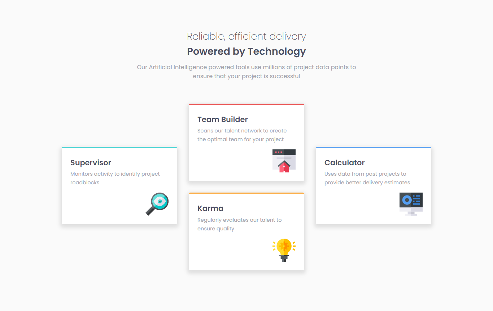
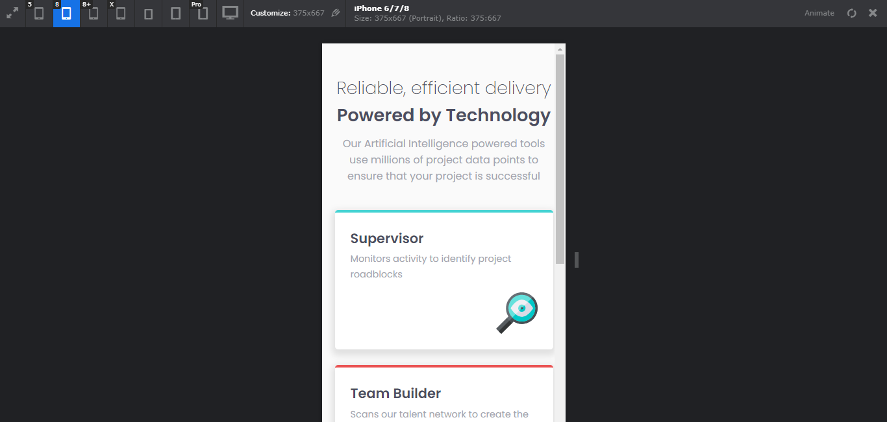
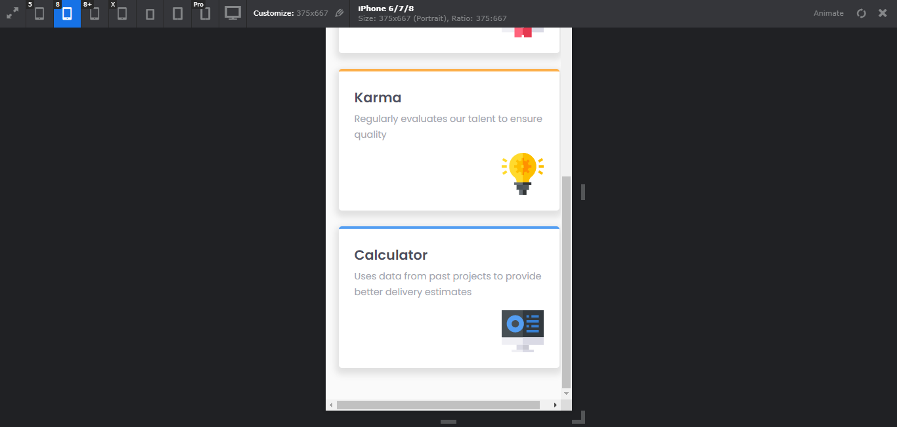

# Frontend Mentor - Four card feature section solution

This is a solution to the [Four card feature section challenge on Frontend Mentor](https://www.frontendmentor.io/challenges/four-card-feature-section-weK1eFYK).

## Table of contents

- [Overview](#overview)
  - [The challenge](#the-challenge)
  - [Screenshot](#screenshot)
  - [Links](#links)
- [My process](#my-process)
  - [Built with](#built-with)
  - [What I learned](#what-i-learned)
  - [Continued development](#continued-development)
  - [Useful resources](#useful-resources)
- [Author](#author)
- [Acknowledgments](#acknowledgments)


## Overview

### The challenge

Users should be able to:

- View the optimal layout for the site depending on their device's screen size

### Screenshot






### Links

- Solution URL: [Add solution URL here](https://your-solution-url.com)
- Live Site URL: [Add live site URL here](https://your-live-site-url.com)

## My process

### Built with

- Semantic HTML5 markup
- CSS custom properties
- Flexbox
- CSS Grid
- Mobile-first workflow


### What I learned

- To use multi-column layout in CSS

```css
  .content {
      column-count: 3;
      column-gap: 2rem;
      height: 35rem;
  }
```

- To indicate where to column-break

```html
  <div class="card col-break" style="border-top: 4px solid var(--clr-primary-orange);">
    <h1>Karma</h1>
    <p>Regularly evaluates our talent to ensure quality</p> 
    
  </div>
```

```css
  .col-break {
      break-after: column;
  }
```

- To keep the content of one element intached in one column

```css
  .card {
      break-inside: avoid;
  }
```


- Finally, to adjust content's position in each column

```html
  <div class="card col-break position" style="border-top: 4px solid var(--clr-primary-cyan);">
    <h1>Supervisor</h1>
    <p>Monitors activity to identify project roadblocks</p>
    
  </div>
  <div class="card position" style="border-top: 4px solid var(--clr-primary-blue);">
    <h1>Calculator</h1>
    <p>Uses data from past projects to provide better delivery estimates</p>
    
  </div>
```

```css
  .position {
      margin-top: 9.5rem;
  }
```

### Useful resources

- [CSS Multi-column Layout](https://developer.mozilla.org/en-US/docs/Web/CSS/CSS_Columns) - Everything about multi-column layout in CSS.

## Author

- GitHub - [Nguyen Hoang Nam](https://github.com/hoangnam-nguyen)
- Frontend Mentor - [@hoangnam-nguyen](https://www.frontendmentor.io/profile/hoangnam-nguyen)
- CodePen - [@hoangnam-nguyen](https://codepen.io/hoangnam-nguyen)

